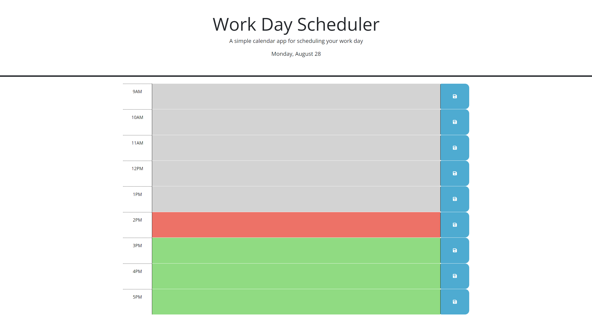
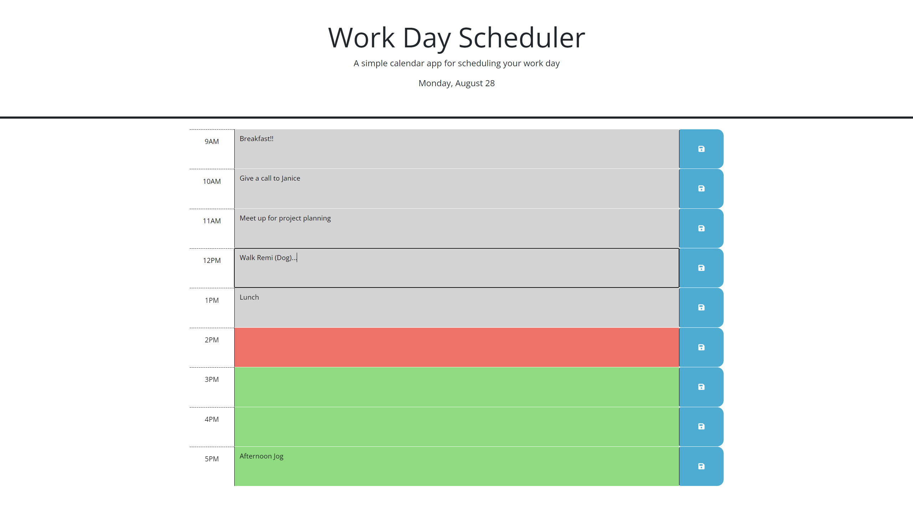

# Work Day Planner

Deployed Program (Quiz Game Website): [https://smindre1.github.io/Work-Day-Planner/](!https://smindre1.github.io/Work-Day-Planner/)

This is a program that creates a day planner from 9am to 5pm with each hour displaying a textarea time block that is color coordinated based on the user's time of loading the webpage. A greyed out time block represents the past, red for the present hour, and green for future hours. The user is able to type into any hour's timeblock and upon having clicked any of the save button on the right side of the page the typed plans will be saved into local storage and won't disapear upon the page being refreshed. On the top of the page the users current day of the week and date will also be displayed.

## Usage

Type your plans out for the day and visit the webpage later to check that you, the user, are on schedule. Just remember to click the save button when you make changes to your plans!

## Credits

All the JS code was built by Shane Mindreau, with the HTML also being heavily changed by Shane Mindreau.

The project's CSS and initial HTMl was provided by Columbia Engineering Coding Boot Camp.

## Images Of Launched Code

## License

MIT License.
